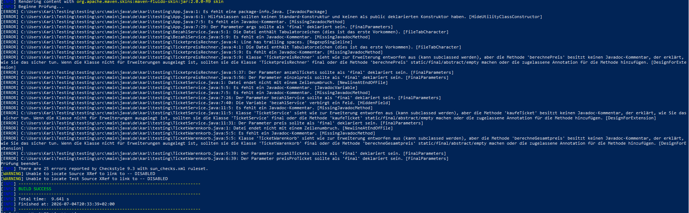
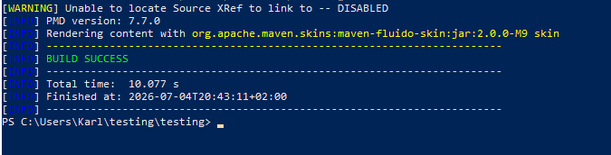
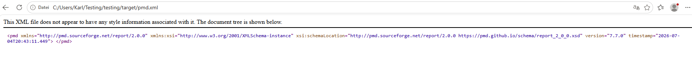

# Metriken

# MET-E1 – Metriken

Verwendet: Checkstyle und PMD

---

# Checkstyle

## Beschreibung

Checkstyle überprüft Java-Quellcode anhand von definierten Programmierregeln. Dabei werden z.B. Verstöße gegen Namenskonventionen, fehlende JavaDoc-Kommentare oder Formatierungsprobleme erkannt.

## Durchführung

Die Analyse wurde mit Maven durchgeführt:

```bash
mvn checkstyle:checkstyle
```

Die Auswertung verlief erfolgreich.

### Screenshot



## Ergebnis

Checkstyle hat verschiedene Hinweise ausgegeben, unter anderem:

- fehlende JavaDoc-Kommentare
- fehlende `final`-Deklarationen
- Tabulatoren im Quellcode
- fehlende package-info.java

Es wurden keine Compilerfehler gefunden. Hinweise dienen der Verbesserung der Codequalität.

---

# PMD

## Beschreibung

PMD analysiert den Quellcode auf typische Qualitätsprobleme. Dazu gehören unter anderem unnötig komplizierter Code, schlechte Programmierpraktiken oder mögliche Wartungsprobleme.

## Durchführung

Die Analyse wurde mit folgendem Maven-Befehl gestartet:

```bash
mvn pmd:pmd
```

Die Ausführung war erfolgreich abgeschlossen.

### Screenshot



## Ergebnis

PMD hat einen Analysebericht (`target/pmd.xml`) erstellt.



Der Bericht enthält keine Beanstandungen, Analysee hat keine Verstöße festgestellt.

---

# Fazit

Beide Werkzeuge konnten problemlos in das Maven-Projekt integriert werden.

Checkstyle konzentriert sich hauptsächlich auf die Einhaltung von Programmier- und Stilrichtlinien. PMD untersucht dagegen zusätzlich die Qualität und Wartbarkeit des Quellcodes.

Ich halte beide Werkzeug für sinnvoll, da sie bereits während der Entwicklung auf mögliche Probleme hinweisen und dadurch die Qualität des Codes verbessern können.
